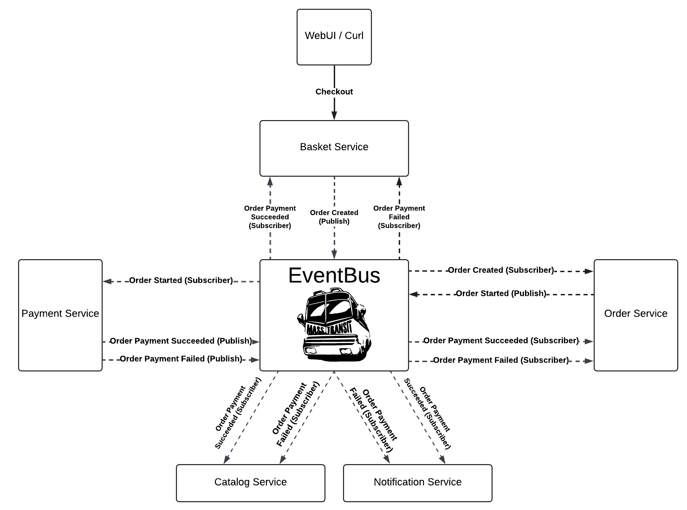

# MassTransitExample

I used this scenario in this sample project

When the user confirms their basket, an OrderCreated event is triggered and is listened to by the Order Service. When a new order is created using the products in the basket, an OrderStarted event is triggered. This event is listened to by the Payment Service. Each time, the payment result is randomly either successful or unsuccessful. Based on the result, either an OrderPaymentSucceeded or an OrderPaymentFailed event is triggered. Services that listen to these events handle the necessary actions within their own consumers.


<p align="center">
  
</p>

## Installation

This way you can clone this repo on your machine
```bash
git clone https://github.com/emreaknci/MassTransitExample.git
```

You can use docker for RabbitMQ
```bash
docker run -d -p 15672:15672 -p 5672:5672 --name c_rabbitmq rabbitmq:3-management
```